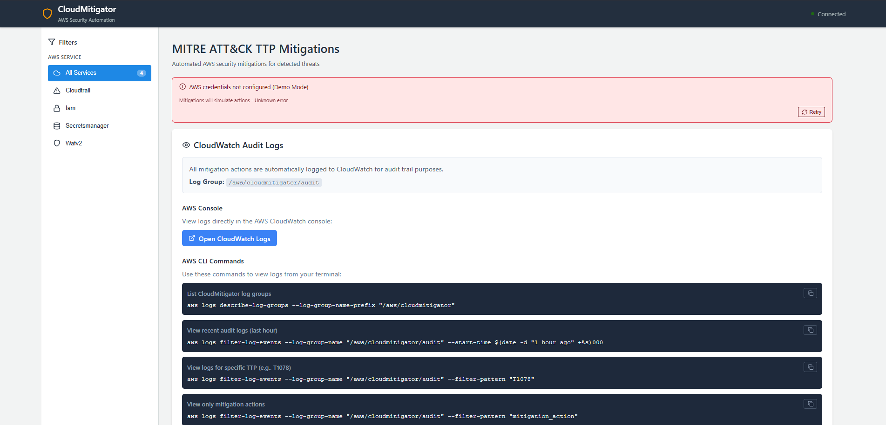
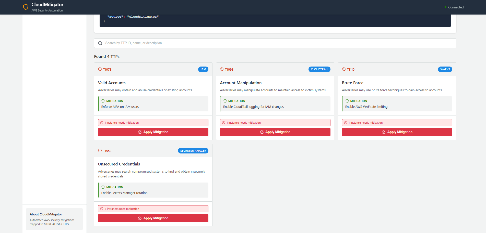
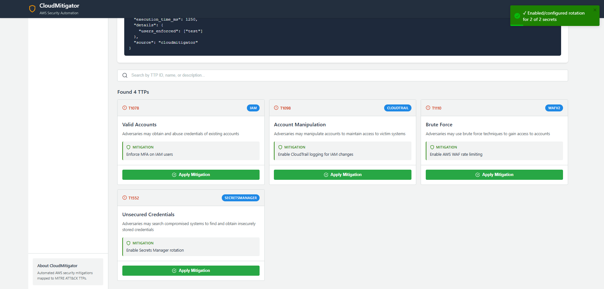
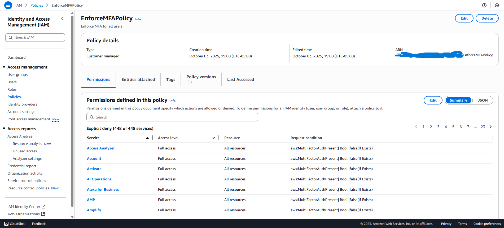
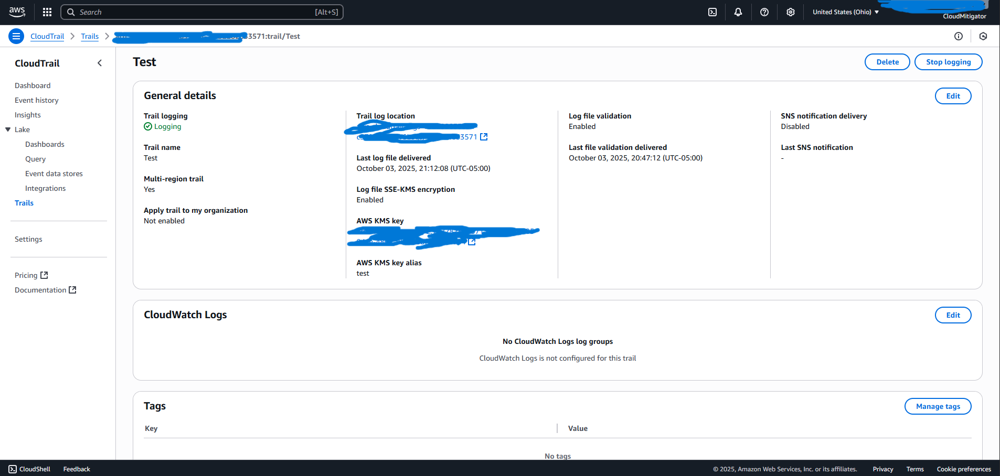
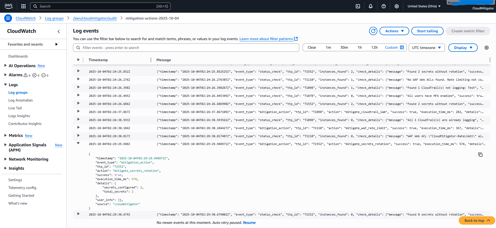

## Demo Screenshots

### Dashboard Overview

The landing page of the app.

---

### TTP Mitigation Cards

Each TTP card shows the MITRE ATT&CK ID, AWS service name, and action buttons for instant remediation.

---

### TTP Mitigation Cards After

Each TTP card turns green after mitigation and displays no active instances in need. 

---

### Mitigation in Action
Example of a one-click AWS security mitigation being applied through the Flask backend.
#### T1078 MFA policy 

A policy that limits actions whenever MFA is not enabled for a user account. 
#### T1098 Cloud Trail

CloudTrail logging is enabled to train IAM changes and events. 
#### T1110

A WAF policy is created which limits traffic. 

---

### CloudWatch Logging & T10552

Mitigation actions are audit-logged to AWS CloudWatch with timestamps and resource details. Displays complete T10552 mitigation.

---

